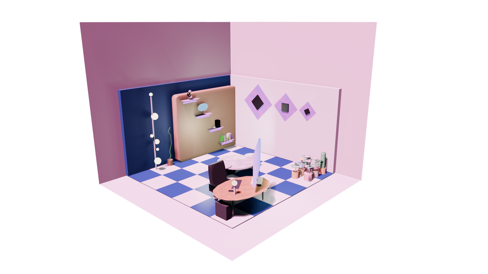

# 🎮 Gaming Room 3D Tasarım

Blender ile hazırlanmış, pembe-mor renk paleti ve damalı zemin detaylarıyla özgün bir gaming odası 3D modeli ve render çalışması.

## 📁 Dosyalar

| Dosya | Açıklama |
|-------|----------|
| `BeyzaErdem_GamingRoom_v01.blend` | Ana Blender proje dosyası |
| `BeyzaErdem_GamingRoom_v01.blend1` | Blender yedek dosyası |
| `BeyzaErdem_Render.png` | Final render görüntüsü |

## 🛠️ Kullanılan Araç
- **Blender** — 3D modelleme ve render

## 🎨 Tasarım Özellikleri
- Pembe-mor duvar renk paleti
- Damalı zemin (beyaz-mavi)
- Hollywood aynası
- Gaming masası ve monitör kurulumu
- Dekoratif raflar ve aksesuarlar

## 👩‍🎨 Geliştirici
**Beyza Erdem** — TNC Group Staj Projesi
